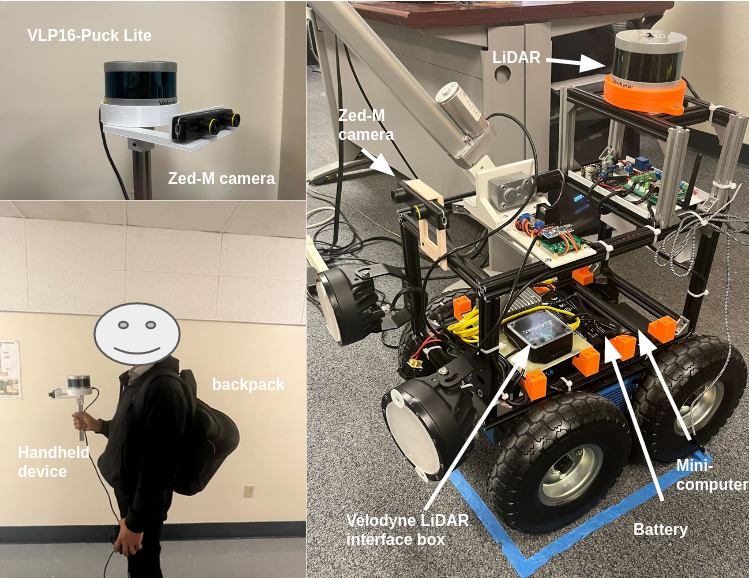
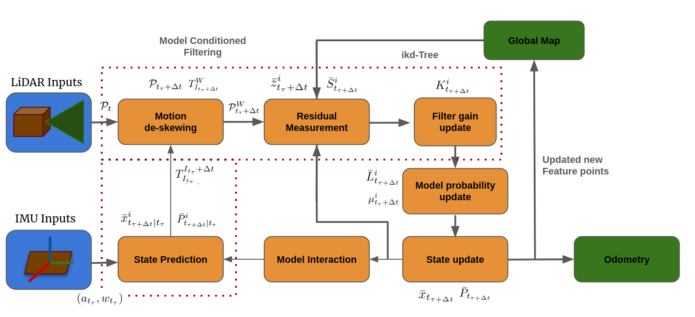
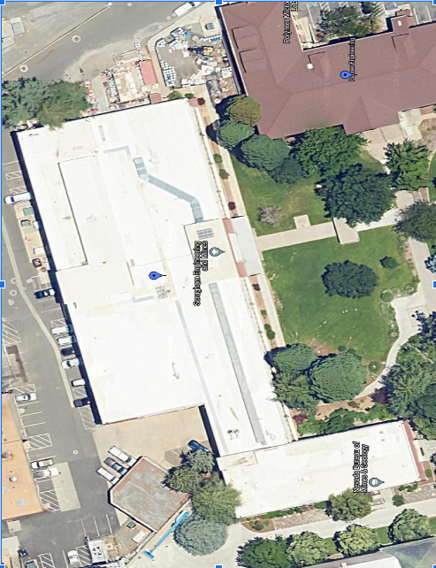
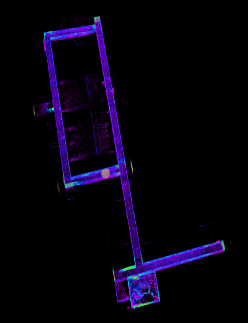
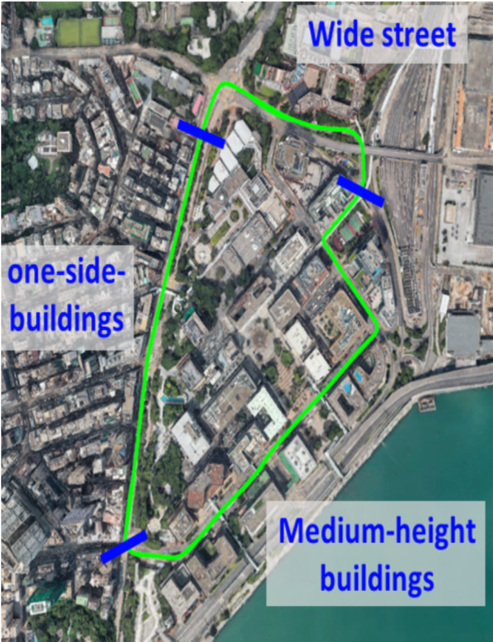
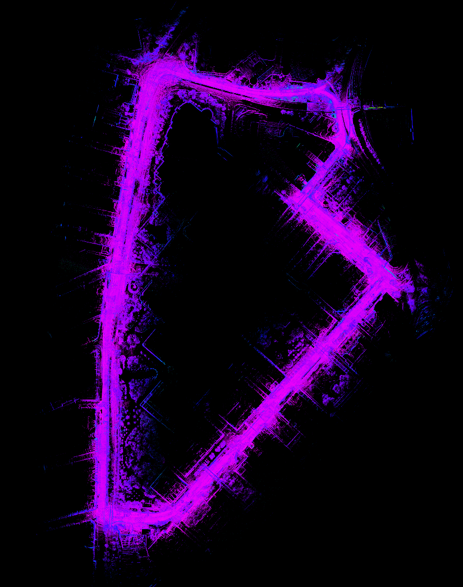

# IMM_LIO

**IMM-LIO (Interaction Multiple Models LiDAR-Inertial Odometry) is a reliable and effective LiDAR-inertial odometry package that supports multiple filters for estimation. It mitigates LiDAR motion distortion by leveraging high-rate IMU data through a tightly-coupled approach using the IMM filter. Three models—constant velocity, acceleration, and turning rate—are employed in this work.**

# Required Installations
- [Ubuntu 20.04](https://releases.ubuntu.com/focal/)
- [ROS Noetic](http://wiki.ros.org/noetic/Installation/Ubuntu)
- [PCL >= 1.8](https://pointclouds.org/downloads/)
- [Eigen >= 3.3.4](http://eigen.tuxfamily.org/index.php?title=Main_Page)
- [ZED SDK >= 3.5](https://www.stereolabs.com/developers)
- [CUDA](https://developer.nvidia.com/cuda-downloads)

# Hardware
- Velodyne PUCK Lite
- Zed-m camera
- Handheld device
- Ground Rover Robot


<p align='center'>
    
</p>

# System workflow
All the variables are described in detail in the [paper](https://drive.google.com/file/d/1a9Zo1jM7xKDSR00Fket8Gw3VihPOR3gR/view?usp=sharing)

<p align='center'>
    
</p>
We have designed a system that supports multiple filters, making it suitable for real-time applications. This package introduces several new features:

1. Support external for 9-axis, and internal 6-axis IMU.
2. The 'State Prediction' module produces multiple estimations, thanks to the use of multiple models. This ensures consistent performance even if one model degrades.
3. The 'Model Probability' module calculates the likelihood of LiDAR measurements with respect to the laser points estimated by each model in IMM. This module contributes to the final estimation and reduces computational complexity compared to direct non-linear filters.


# Install
Use the following commands to download and build the package:

```
    cd ~/caktin_ws/src    // caktin_ws or your ROS Dir
    git clone https://github.com/aralab-unr/IMM_LIO.git
    cd IMM_LIO
    cd ../..
    source devel/setup.bash
    catkin_make
```
# Prepare Rosbag for running
1. Setup LiDAR and IMU before run. To achieve optimal performance, it is essential to calibrate and synchronize both the LiDAR and IMU.
2. Edit the file ``` config/velodyne.yaml ``` or ``` config/ouster64.yaml ``` to set the parameters.
3. Set the LiDAR and IMU topic at: ```lid_topic```, ```imu_topic```
4. Change the LiDAR, and IMU extrinsic calibration parameters: ``` extrinsic_R ``` , and ``` extrinsic_T ``` .
5. Set the IMU as base frame
6. Run the launch file: ``` roslaunch imm_lio velodyne.launch ```
7. Play existing bag files: ``` rosbag play your-file.bag ```
8. Download [sample dataset](https://drive.google.com/drive/folders/1Bxe2sPL9lQXFsh6_xb5OAr8OxKFyTGON?usp=drive_link) which are collected in UNR campuse to test the package. In these dataset, the point cloud topic is ``` "/velodyne_points"```, and the imu topic need to be set to ``` "zed/zed_nodelet/imu/data"```
9. Download Urban Hong Kong dataset [medium-urban](https://www.dropbox.com/s/mit5v1yo8pzh9xq/UrbanNav-HK_TST-20210517_sensors.bag?e=1&dl=0) [deep-urban](https://www.dropbox.com/s/1g3dllvdrgihkij/UrbanNav-HK_Whampoa-20210521_sensors.bag?e=1&dl=0). Set the imu topic to ```"/imu/data" ```.

<p align='center'>
    
    
    
    
</p>

<p align='center'>
    
</p>
# Related Package
- [LiDAR-IMU calibration](https://github.com/hku-mars/LiDAR_IMU_Init)

- [Fast-LIO2](https://github.com/hku-mars/FAST_LIO?tab=readme-ov-file)

# Acknowledgement
- IMM_LIO is based on the FAST_LIO2 (Wei Xu, Yixi Cai, Dongjiao He, Jiarong Lin, Fu Zhang, Fast-Lio2: Fast Direct LiDAR-inertial Odometry)

# Contact
- [An Nguyen](mailto:anguyenduy@nevada.unr.edu)
